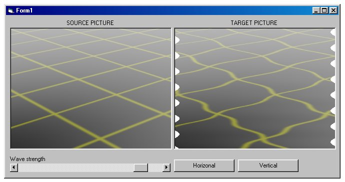



## Cool Wave FX

### Description

This code paints a bitmap from picturebox to another and gives it a cool wave effect, horizonal and vertical are available.
 
### More Info
 

             |
---                |---
**Submitted On**   |2002-07-06 18:31:30
**By**             |[Harri E Nyman](https://github.com/Planet-Source-Code/PSCIndex/blob/master/ByAuthor/harri-e-nyman.md)
**Level**          |Intermediate
**User Rating**    |4.8 (19 globes from 4 users)
**Compatibility**  |VB 5\.0, VB 6\.0
**Category**       |[Graphics](https://github.com/Planet-Source-Code/PSCIndex/blob/master/ByCategory/graphics__1-46.md)
**World**          |[Visual Basic](https://github.com/Planet-Source-Code/PSCIndex/blob/master/ByWorld/visual-basic.md)
**Archive File**   |[Cool\_Wave\_102805762002\.zip](https://github.com/Planet-Source-Code/harri-e-nyman-cool-wave-fx__1-36638/archive/master.zip)

